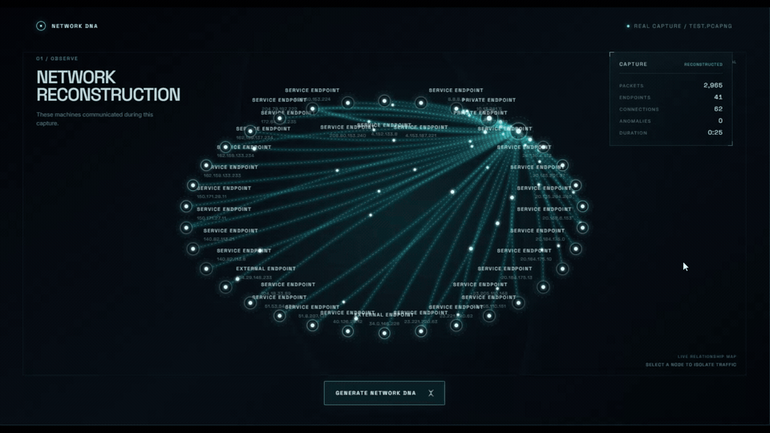
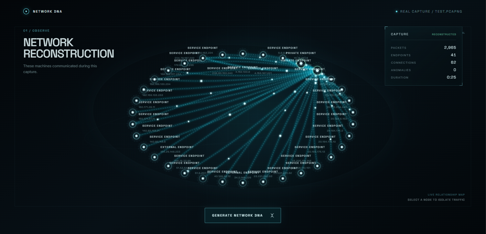
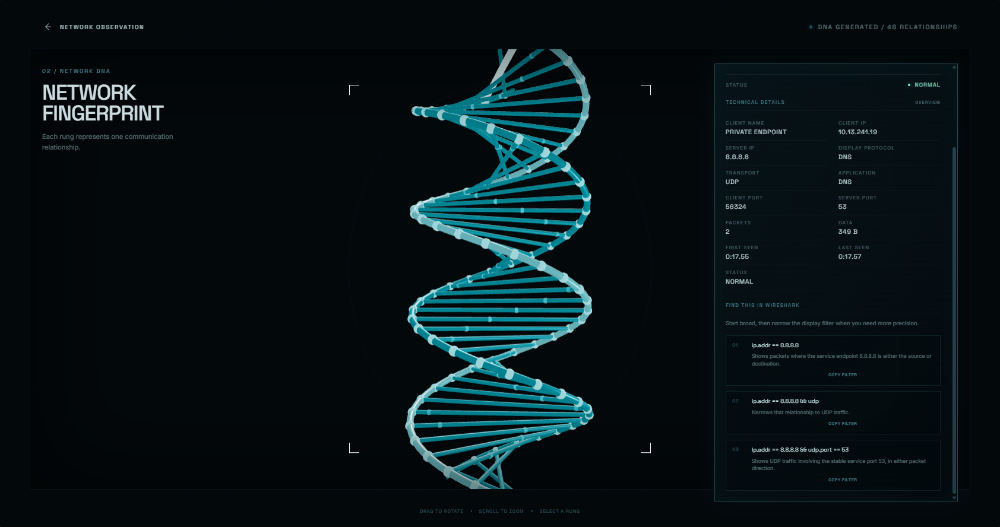
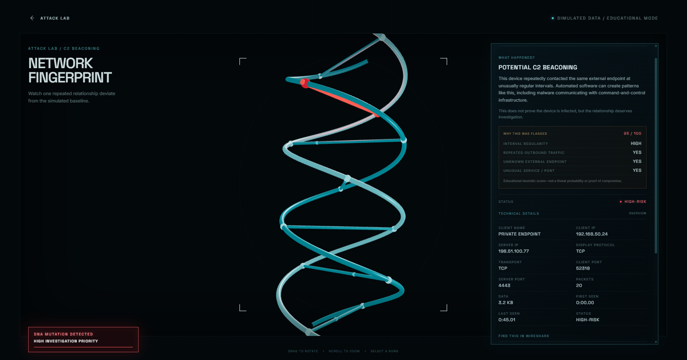

# Network DNA

**Your network has a fingerprint.**

Network DNA transforms Wireshark/TShark packet captures into an interactive visual representation of network communication—not another endless feed of packets and logs. Load a real `.pcap` or `.pcapng`, observe its communication structure, reorganize those relationships into a 3D double helix, and learn how to investigate an individual connection in Wireshark.



*Real PCAP traffic reconstructed as a network topology and transformed into Network DNA.*

## Beyond the Feed

Feeds are not limited to social media. Security analysts, developers, and engineers also work through feeds of packets, logs, alerts, and telemetry.

Built for the **Beyond the Feed** hackathon theme, Network DNA explores what happens when network activity becomes an explorable structure instead of another feed.

```text
PCAP / PCAPNG
      ↓
Wireshark / TShark
      ↓
Python conversation aggregation
      ↓
Network topology
      ↓
Interactive 3D Network DNA
      ↓
Decode relationship
      ↓
Wireshark investigation
```

## What works

- Real `.pcap` and `.pcapng` analysis through a local FastAPI service
- TShark packet-field extraction and capinfos capture metadata
- Bidirectional TCP/UDP conversation aggregation with stable endpoint roles
- Interactive network topology with animated packet activity
- Cinematic topology-to-DNA transformation
- Interactive Three.js DNA helix with rotation, zoom, hover, and selection
- One DNA rung per visualized communication relationship
- Beginner-friendly Decode Mode and progressive technical details
- Role-aware Wireshark display-filter generation and clipboard controls
- Attack Lab with a deterministic Potential C2 Beaconing simulation
- Explainable educational heuristic and localized DNA mutation visualization

For large captures, the interface visualizes the 48 highest-activity relationships while retaining full capture totals in the HUD.



*An actual packet capture processed through TShark and reconstructed into bidirectional communication relationships.*

## Visual language

| Visual element | Meaning |
| --- | --- |
| DNA structure | Network communication fingerprint |
| DNA rung | One communication relationship |
| Moving pulse | Packet activity |
| Pulse rate and intensity | Relative traffic behavior |
| Cyan and white | Normal observation |
| Amber or red mutation | Behavior deserving investigation |

**Red means investigate—not “malware confirmed.”** Network DNA communicates evidence and investigation priority without presenting a visual pattern as proof of compromise.

## Learn first, then investigate

Selecting a DNA relationship starts with plain-language context and progressively reveals technical depth:

```text
WHAT IS THIS?
      ↓
DECODE CONNECTION
      ↓
TECHNICAL DETAILS
      ↓
FIND THIS IN WIRESHARK
```



*Decode Mode progresses from a beginner-friendly explanation to technical connection details and generated Wireshark investigation filters.*

Decode Mode uses the parsed client/server or neutral endpoint model, protocol information, ports when available, packet and byte totals, timing, and status. It then creates valid Wireshark display filters with short explanations of what each filter selects.

Network DNA is designed to complement Wireshark, not replace it. Its purpose is to make communication patterns understandable and help users know what to investigate next.

## Attack Lab: Potential C2 Beaconing

Attack Lab is a clearly labeled, safe educational simulation. Its implemented scenario shows one internal endpoint repeatedly contacting the same unknown external endpoint at approximately regular intervals.



*Simulated educational C2-style beaconing creates a red mutation representing behavior deserving investigation—not confirmed malware.*

The deterministic heuristic evaluates:

- interval regularity
- repeated outbound communication
- an unknown external endpoint
- an unusual service or port

As the pattern develops, only the affected DNA relationship progresses from normal cyan/white through amber to a controlled red mutation. Selecting it explains why the behavior was flagged and provides safe Wireshark investigation filters.

The simulation does not generate network traffic, contact an external system, or run malicious code. Its score is an educational investigation heuristic—not a production threat probability—and the pattern does not prove malware is present.

## Architecture

```text
React + TypeScript + Vite
          │
          │ multipart capture upload
          ▼
       FastAPI
          │
          │ reuses the existing parser
          ▼
TShark extraction + capinfos metadata
          │
          ▼
Python bidirectional conversation aggregation
          │
          │ normalized data contract
          ▼
Frontend adapter
          │
          ├── SVG network topology
          ├── React Three Fiber / Three.js DNA
          └── Decode Mode / Wireshark filters
```

Uploaded captures are written to an ignored temporary backend directory, processed locally, and removed after each request. The frontend adapter preserves client/server roles when supported by the parser and keeps ambiguous conversations neutral rather than guessing.

## Technology

- React
- TypeScript
- Vite
- Three.js
- React Three Fiber
- Python
- FastAPI
- Wireshark / TShark / capinfos

## Run locally

### Prerequisites

- Node.js and npm
- Python 3
- Wireshark with both `tshark` and `capinfos` available on `PATH`

On Windows, the parser also checks the standard Wireshark installation directory under `C:\Program Files\Wireshark`.

### 1. Start the backend

From the repository root in PowerShell:

```powershell
python -m venv .venv
.\.venv\Scripts\Activate.ps1
python -m pip install -r .\backend\requirements.txt
python -m uvicorn backend.main:app --reload
```

Optional health check:

```powershell
Invoke-RestMethod http://127.0.0.1:8000/api/health
```

The response should report `status: ready`.

### 2. Start the frontend

In a second PowerShell terminal at the repository root:

```powershell
npm ci
npm run dev -- --host 127.0.0.1 --port 5173 --strictPort
```

Open `http://127.0.0.1:5173`.

Port `5173` is required by the current local FastAPI CORS configuration. The frontend expects the API at `http://127.0.0.1:8000` by default. A different API address can be supplied with `VITE_API_URL` before starting Vite, but the backend CORS configuration must allow the frontend origin.

Use a known, non-sensitive `.pcap` or `.pcapng` for testing. Capture files are intentionally ignored by Git and should not be committed.

## Demo paths

```text
Load Capture
→ Observe Network
→ Generate Network DNA
→ Select Relationship
→ Decode
→ Investigate in Wireshark
```

```text
Attack Lab
→ C2 Beaconing
→ DNA Mutation
→ Investigate
```

## Scope and safety

Network DNA is a local hackathon prototype, not a production intrusion-detection system.

- Real capture parsing currently covers IPv4 TCP and UDP traffic.
- Application protocols are used only when TShark identifies them; they are not asserted solely from port numbers.
- Ambiguous relationships retain neutral Endpoint A/B roles.
- Attack Lab uses deterministic in-app data and does not generate malicious traffic.
- Detection heuristics are educational and do not prove malicious activity.
- The upload API is intended for localhost use and has no production authentication or deployment hardening.

## Future work

- Live capture
- Port Scan Attack Lab scenario
- Data Exfiltration Attack Lab scenario
- Timeline and rewind
- Richer endpoint identity enrichment
- IPv6 capture support
- Improved session separation using fields such as `tcp.stream`

These items are not part of the current implementation.

## Team

### Ethan — Frontend & Visualization Lead

- Product concept and UX direction
- React/TypeScript frontend
- Network topology visualization
- Three.js / React Three Fiber Network DNA visualization
- Topology-to-DNA transformation
- Decode Mode and Wireshark learning experience
- Attack Lab UI and DNA mutation experience
- Frontend/backend integration and end-to-end testing

### Kyle — Network Data & Wireshark Lead

- Wireshark/TShark research and packet analysis
- PCAP/PCAPNG capture testing
- Network packet-field identification
- Bidirectional conversation data model
- Packet-to-connection aggregation design
- Python/TShark parser development
- Client/server role inference
- Data contract and realistic test/mock datasets
- Parser validation against real packet captures

### Shared

- Network DNA concept development
- Cybersecurity research
- Wireshark learning and validation
- Testing, debugging, and hackathon presentation
